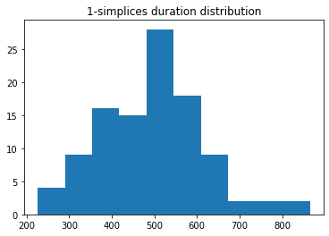
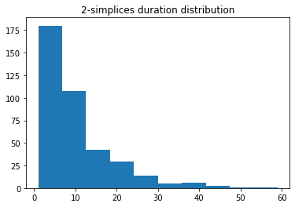

# conf-complex-network

## implementation
### V0
The V0 consist our first algorithm which is not pertinet for the structure of simplificial complex.

### V1
The V1 uses augmented signatures to create 1-simplices. 
For 2-simplex, we applied lasso regression to find relations between signatures of lead-lag transformation of 1 time series and signatures of couples of time series. We use the package "simplicial" to stock and analysis complex.

### V2
IMPORTANT : One should override the drawing.py and base.py of the package simplicial by our modified version.

For analysis of simplicial complex, we add the hyper coherence (Santoro, Andrea, et al. "Higher-order organization of multivariate time series." Nature Physics 19.2 (2023): 221-229.). We study also the life duration distribution of 2-simplex : during a period t in [a,b], we calculate how many times each 2-simplex occured.  

## dataset 
1 . daily prices of 119 NYSE stocks for the period spanning from 1999-12-31 to 2021-06-17.
2 . resting-state fMRI signals of the 100 unrelated subjects from the Human Connectome Project (HCP, http://www.humanconnectome.org/), preprocessed by the pipeline of "higher-order organization of multivariate time series Andrea Santoro, Federico Battiston, Giovanni Petri, and Enrico Amico". 

## result
The 1-simplex and 2-simplex are coherent for financial dataset, which confirms signature features
For a non public medical dataset, we found a small fraction of 2-simplex that persist. 
We try to confirm our method by known interactions of cortex. The most persistent 1-simplex correspond to a well-known interation within the 15 cortex tested.
Here are the life duration distribution :

